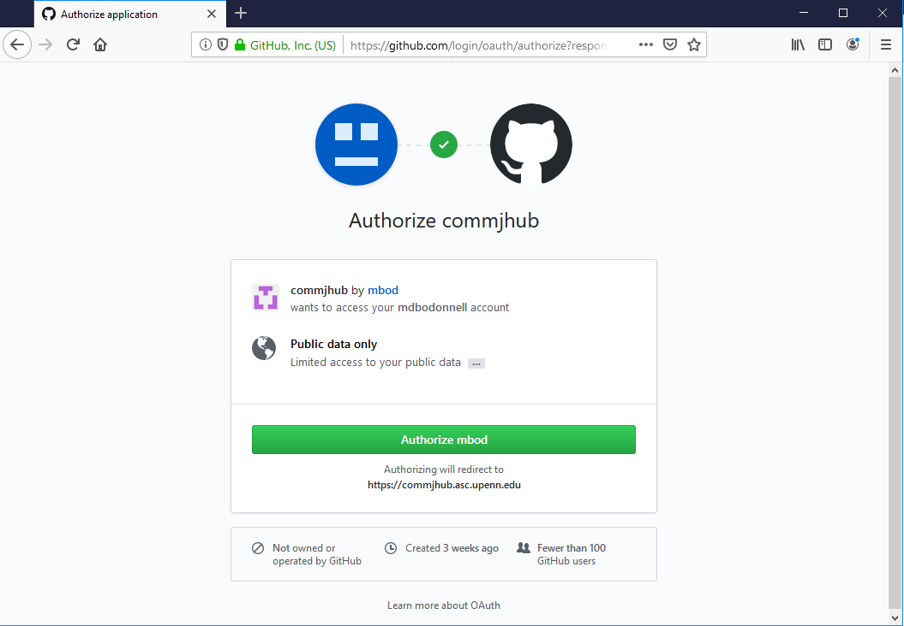
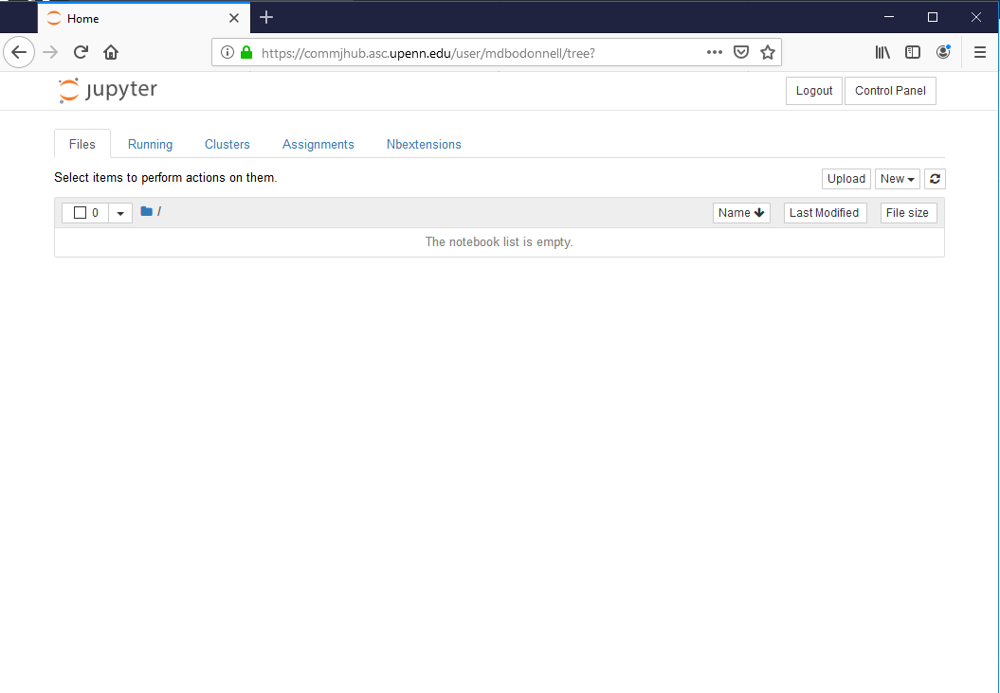
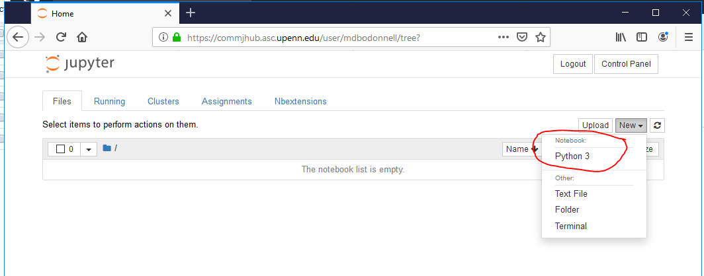
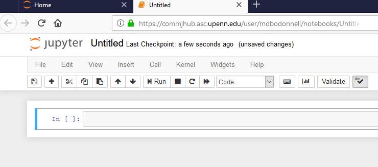
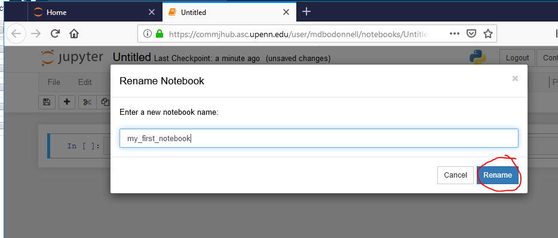

## Instructions on logging into the COMM318 JupyterHub

#### Step 1. Go to `https://commjhub.asc.upenn.edu`

* You should see a log in screen asking you to use GitHub to authenticate.

#### Step 2. Authenticate with your github account

