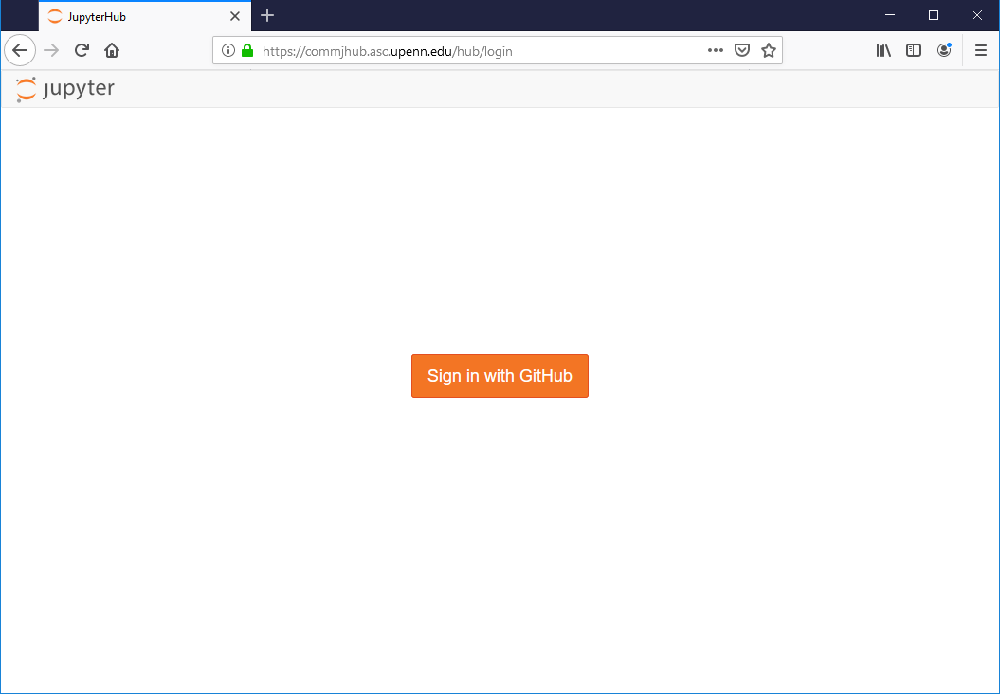

## Instructions on logging into the COMM318 JupyterHub

#### HISTORY

* 8/28/19 mbod - inital steps outlined

----------

#### Step 1. Go to `https://commjhub.asc.upenn.edu`

* You should see a log in screen asking you to sign in using GitHub.

* Click on this.

#### Step 2. Authenticate with your github account

* Click on the green `Authorize mbod` button.

#### Step 3. Successful access should show you this view

* This is your JupyterHub server account.

* It is a web-based notebook and file system environment. This will allow you to create Python notebooks and other types of files and folders. You can also upload files (e.g. images and data files).

#### Step 4. Create a test notebook

* Click on the __New__ menu on the right hand side.
* Select `Python 3`

* This will create an untitled Python notebook in your user space.

* The first thing you should always do is rename it by clicking on the title.
* Use a name that makes sense and **USE UNDERSCORES INSTEAD OF SPACES**.
    * For example:
        * __NOT__ `my first notebook test`
        * __BUT__ `my_first_notebook_test`
        

